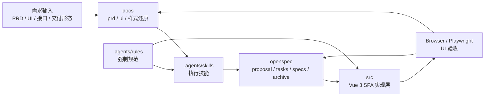
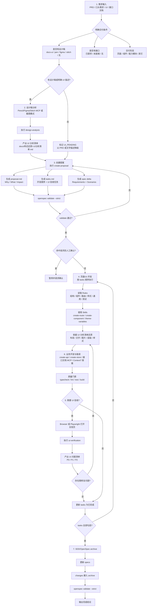
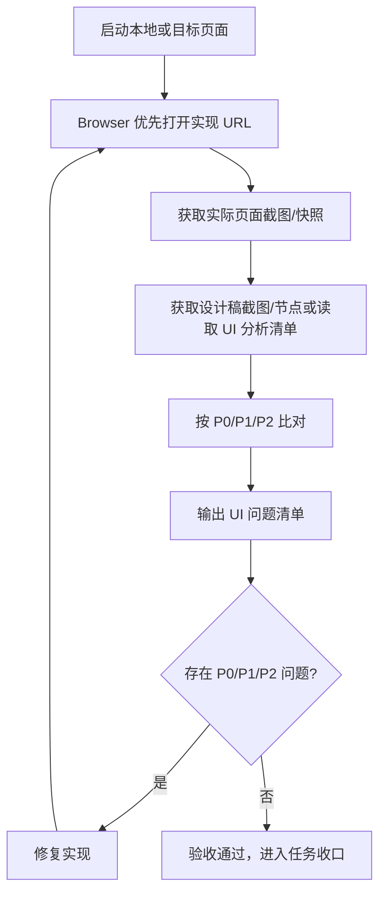

# 仓库架构设计文档

## 1. 文档范围

本文档基于当前工作区文件、`.agents` 规则/技能、`docs` 输入资产、`openspec` 治理资产，以及 Git HEAD 中仍可追溯的前端实现结构进行扫描整理。

当前仓库的核心定位不是单纯的业务代码仓库，而是一个面向 AI Coding 的治理型前端工程模板：用 PRD 与设计稿作为输入，用 Rules 约束行为，用 Skills 指导执行，用 OpenSpec/SDD 管理变更生命周期，最终把页面/UI、接口、状态、验收和归档串成可审计闭环。


## 2. 总体架构



仓库采用“治理资产 + 输入资产 + 执行资产 + 实现资产”的分层方式：

| 层级 | 目录 | 职责 |
| --- | --- | --- |
| 治理约束层 | `.agents/rules/` | 定义项目结构、组件、路由、API、状态、样式、测试、自动化流程等强制规范 |
| 执行技能层 | `.agents/skills/` | 将规则转换为可执行步骤，例如创建提案、设计分析、路由开发、组件拆分、UI 验收 |
| 需求输入层 | `docs/prd/`、`docs/ui/` | 存放 PRD、设计稿截图或设计源映射信息 |
| 分析验收层 | `docs/样式还原/` | 存放 UI 分析清单与 UI 问题清单 |
| 变更治理层 | `openspec/` | 管理 proposal、tasks、spec delta、validate、archive |

## 3. 技术栈识别

根据 `.agents/rules/01-项目概述.instructions.md`，目标技术栈如下：

| 类别 | 技术 |
| --- | --- |
| 前端框架 | Vue 3.x |
| 类型系统 | TypeScript 5.x |
| 构建工具 | Vite 5.x |
| 路由 | Vue Router 4.x |
| 状态管理 | Pinia 2.x |
| UI 组件库 | Ant Design Vue 4.x |
| 样式 | Scoped SCSS，必要时 CSS Modules |
| HTTP | axios |
| 日期工具 | dayjs |
| 工具库 | lodash-es |
| 代码质量 | Biome、vue-tsc |
| 包管理 | pnpm >= 10.32.0 |
| Node | >= 22.22.0 |

Git HEAD 中的前端运行脚本：

| 命令 | 作用 |
| --- | --- |
| `pnpm dev` | 启动 Vite 开发服务 |
| `pnpm build` | `vue-tsc --noEmit` 后执行 Vite 构建 |
| `pnpm typecheck` | TypeScript 类型检查 |
| `pnpm lint` | Biome 检查 |
| `pnpm format` | Biome 格式化 |

## 4. 仓库目录职责

```text
.
├── .agents/
│   ├── rules/                 # 强制规则，不自动加载，按场景读取
│   └── skills/                # 技能，每个技能目录包含 SKILL.md
├── docs/
│   ├── architecture/          # 架构设计文档
│   ├── prd/                   # PRD 输入
│   ├── ui/                    # UI 截图输入
│   └── 样式还原/               # UI 分析清单、UI 问题清单
├── openspec/
│   ├── project.md             # 项目上下文
│   ├── AGENTS.md              # OpenSpec 工作流说明
│   ├── templates/             # PRD + UI 自动实现模板
│   ├── changes/               # 活跃变更
│   └── specs/                 # 已归档后的当前规格
```

## 5. 核心资产关系

### 5.1 PRD 输入

`docs/prd/*.md` 是自动化链路入口。当前存在三个示例 PRD：

| PRD | 交付形态 | 主设计源 | UI 分析清单 |
| --- | --- | --- | --- |
| `docs/prd/workbench.md` | 页面 | Stitch | `docs/样式还原/workbench-UI分析清单.md` |
| `docs/prd/object-type-list.md` | 页面 | Stitch | `docs/样式还原/object-type-list-UI分析清单.md` |
| `docs/prd/object-type-create.md` | 页面/向导组件 | Stitch | `docs/样式还原/object-type-create-UI分析清单.md` |

PRD 中的关键字段：

| 字段 | 作用 |
| --- | --- |
| `prd_slug` | PRD 主键，也是分析清单、问题清单命名基础 |
| `primary_design_source` | 主设计源，支持 `docs-ui`、`pen`、`figma`、`stitch` |
| `required_ui_assets` | `docs/ui` 必需截图 |
| `design_pen_files` | Pencil 文件路径 |
| `figma_links` | Figma 链接 |
| `stitch_links` | Stitch 链接 |
| `ui_analysis_output` | UI 分析清单输出路径 |
| `ui_verification_output` | UI 问题清单输出路径 |

### 5.2 Rules 约束

`.agents/rules` 是项目执行时的权威约束来源：

| 规则 | 适用阶段 |
| --- | --- |
| `01-项目概述` | 识别技术栈与工程定位 |
| `02-编码规范` | 编码与审查 |
| `03-项目结构` | 决定代码放置目录 |
| `04-组件规范` | 创建/拆分组件 |
| `05-API规范` | 新增或调整接口 |
| `06-路由规范` | 新增页面或配置路由 |
| `07-状态管理` | 新增或重构 Pinia store |
| `08-通用约束` | 占位、通用限制、执行边界 |
| `09-样式规范` | UI 还原、主题、组件样式 |
| `10-文档规范` | 注释和文档 |
| `11-测试规范` | 类型、lint、测试门禁 |
| `12-自动化执行规范` | PRD + UI 自动实现闭环 |

### 5.3 Skills 执行

`.agents/skills` 是把规则转成操作步骤的执行层：

| 技能 | 职责 |
| --- | --- |
| `implement-from-prd-ui` | PRD + UI 自动实现总入口 |
| `design-analysis` | 读取设计稿或截图，产出 UI 分析清单 |
| `create-proposal` | 创建 SDD/OpenSpec proposal、tasks、spec delta |
| `create-route` | 新增或维护页面路由 |
| `create-component` | 创建通用组件或页面级组件 |
| `theme-variables` | 主题变量与样式规范 |
| `create-api` | 接口类型与请求封装 |
| `create-store` | Pinia store 创建与维护 |
| `ui-verification` | 浏览器验收、差异分级、问题清单 |
| `openspec-apply-change` | 按 tasks 实施 OpenSpec 变更 |
| `openspec-archive-change` | 完成后归档变更 |

### 5.4 OpenSpec 治理

OpenSpec 是变更生命周期主线：

```text
openspec/
├── changes/<change-id>/
│   ├── proposal.md
│   ├── tasks.md
│   ├── design.md              # 复杂变更时需要
│   └── specs/<capability>/spec.md
└── specs/<capability>/spec.md  # 归档后的当前真实规格
```

关键命令：

| 命令 | 阶段 |
| --- | --- |
| `openspec list` | 查看活跃变更 |
| `openspec list --specs` | 查看当前规格 |
| `openspec validate <change-id> --strict` | 提案进入实施前校验 |
| `openspec archive <change-id> --yes` | 任务完成后归档 |
| `openspec validate --strict` | 归档后全量校验 |

## 6. 从需求到归档的完整链路



## 7. 关键阶段设计

### 7.1 需求输入

需求输入阶段必须收敛三个问题：

| 问题 | 可选项 | 后续影响 |
| --- | --- | --- |
| 是否有设计稿 | 有 / 无 / 仅 UI 描述 | 有则进入设计分析；无则标记 `UI_PENDING` |
| 是否有接口 | 已提供 / 未就绪 / 无 | 已提供则对接；未就绪则 mock；无则可跳过数据层 |
| 交付形态 | 页面 / 组件 / 能力模块 / 其它 | 决定路由、组件、状态、API 的任务拆分 |

输入优先级：

1. 明确 PRD 路径，例如 `docs/prd/object-type-create.md`。
2. PRD 内声明的 `primary_design_source`。
3. PRD 内的 `required_ui_assets`、`.pen`、Figma、Stitch 链接。
4. `docs/ui/<prd_slug>*` 兜底截图。
5. 用户补充的 UI 文字描述。

### 7.2 设计稿分析

有设计稿时必须先执行 `design-analysis`，再进入 proposal。

| 设计源 | 读取方式 | 输出 |
| --- | --- | --- |
| `docs-ui` | 截图模式，读取 `docs/ui` | 标注证据等级的 UI 分析清单 |
| `pen` | Pencil MCP 读取结构、截图、节点 | UI 分析清单 |
| `figma` | Figma MCP 读取 frame 或节点 | UI 分析清单 |
| `stitch` | Stitch MCP 读取页面、画板、节点 | UI 分析清单 |

分析顺序固定为：从上到下、从左到右、从外到里。分析内容必须覆盖文字、图片、布局、层级，并在截图模式下标注“精确 / 估算 / 待确认”证据等级。

### 7.3 创建提案

`create-proposal` 负责把需求转换为 OpenSpec 变更资产：

```text
openspec/changes/<change-id>/
├── proposal.md
├── tasks.md
├── design.md
└── specs/<capability>/spec.md
```

提案必须包含：

| 文件 | 内容 |
| --- | --- |
| `proposal.md` | Why、What Changes、Impact |
| `tasks.md` | 准备、开发、接口、状态、质量门禁、UI 验收、归档前检查 |
| `spec.md` | `ADDED/MODIFIED/REMOVED Requirements` 与至少一个 `#### Scenario:` |
| `design.md` | 跨模块、复杂数据模型、新依赖、安全/性能/迁移时使用 |

提案完成后必须执行：

```bash
openspec validate <change-id> --strict
```

### 7.4 页面/UI 开发

开发阶段以 `tasks.md` 为顺序，以 Rules 为强制约束，以 Skills 为操作指南。

页面开发读取：

| 场景 | Rules | Skills |
| --- | --- | --- |
| 新页面 | `03-项目结构`、`06-路由规范` | `create-route` |
| 页面级组件 | `03-项目结构`、`04-组件规范` | `create-component` |
| 通用组件 | `04-组件规范` | `create-component` |
| 样式还原 | `09-样式规范` | `theme-variables` |
| 接口接入 | `05-API规范` | `create-api` |
| 全局状态 | `07-状态管理` | `create-store` |
| 质量门禁 | `11-测试规范` | 项目脚本 |

UI 实现必须对齐 UI 分析清单中的：

1. 布局区域、尺寸、间距、对齐。
2. 文案、图标、图片、占位元素。
3. 父子/兄弟层级和叠放关系。
4. 颜色、字号、字重、圆角、边框、阴影。
5. 默认、hover、active、disabled、loading、empty、error 等状态。

### 7.5 UI 验收

实现完成后执行 `ui-verification`。



问题分级：

| 等级 | 范围 | 处理要求 |
| --- | --- | --- |
| P0 | 布局、层级、文字、图片缺失或严重偏差 | 必须修复并回归 |
| P1 | 间距、颜色、字号、状态等明显差异 | 应修复并回归 |
| P2 | 轻微视觉差异、可后续优化项 | 可记录风险或排期 |

输出路径：

```text
docs/样式还原/<prd_slug>-UI问题清单.md
```

### 7.6 业务开发与联调

业务层主要包括 API、类型、状态与交互数据流。

当前规则约定：

| 类型 | 目录 |
| --- | --- |
| 请求封装 | `src/services/<feature>.ts` |
| 类型定义 | `src/types/<feature>/api.ts`、`src/types/<feature>/model.ts` |
| 全局状态 | `src/stores/<module>.ts` |
| 页面本地状态 | 页面或组件内部 `ref/reactive` |

接口未就绪时采用 mock 策略：

1. 在请求封装文件中提供模拟请求函数。
2. 类型仍按未来接口定义，避免后续迁移成本。
3. mock 覆盖默认态、空态、加载失败、无权限等关键状态。
4. 权限、枚举、接口字段需要标记替换点。

接口文档 MCP 与 Context7 属于按需增强工具：当需要查接口契约、第三方库文档、框架最新用法时接入，但不改变本仓库的主流程。

### 7.7 归档

归档前必须确认：

1. `tasks.md` 所有任务真实完成并勾选。
2. 类型检查、lint、测试或构建门禁通过，无法执行时记录原因。
3. UI 问题清单已产出；P0 必须关闭并回归。
4. spec delta 能正确合并到 `openspec/specs`。

归档命令：

```bash
openspec archive <change-id> --yes
openspec validate --strict
```

归档后的目录形态：

```text
openspec/changes/archive/YYYY-MM-DD-<change-id>/
openspec/specs/<capability>/spec.md
```

## 8. 质量门禁

| 阶段 | 门禁 |
| --- | --- |
| Proposal | `openspec validate <change-id> --strict` |
| 开发 | TypeScript 类型检查 |
| 开发 | Biome lint |
| 开发 | 必要测试或明确自测记录 |
| UI | Browser/Playwright 实际页面验收 |
| UI | P0 问题修复后回归 |
| 归档 | `openspec archive <change-id> --yes` |
| 归档后 | `openspec validate --strict` |


## 9. 推荐落地原则

1. 规则优先级：`.agents/rules` 高于技能示例，高于 README 描述。
2. 设计源优先级：PRD `primary_design_source` 高于目录兜底匹配。
3. 变更先治理：新增功能、架构变化、页面能力必须先 proposal + validate。
4. UI 先分析再实现：有设计稿时不跳过 `design-analysis`。
5. 实现后必须看页面：UI 验收以 Browser/Playwright 的实际页面为准。
6. 归档必须更新规格：完成不是代码写完，而是 tasks 勾选、spec 更新、change 入 archive。

## 10. 交付物清单

一个完整 PRD + UI 需求完成后，应该至少留下这些产物：

```text
docs/prd/<prd_slug>.md
docs/样式还原/<prd_slug>-UI分析清单.md
openspec/changes/archive/YYYY-MM-DD-<change-id>/
openspec/specs/<capability>/spec.md
docs/样式还原/<prd_slug>-UI问题清单.md
src/...                       # 页面、组件、接口、状态、样式实现
```

这套产物让需求来源、设计依据、实现任务、验收结论和最终规格都能被追溯，形成从需求输入到归档的完整工程闭环。
