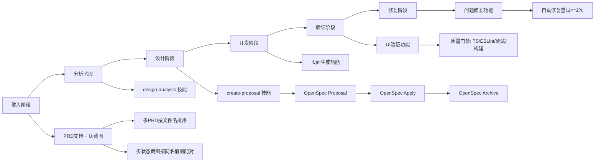

# PRD + UI 自动实现端到端流程图

## 1. 适用范围

本流程用于语义触发“基于 docs/prd 与 docs/ui 自动实现前端工程”的执行链路，目标为“上线就绪”。

## 2. 阶段与能力映射图（Flowchart）



## 3. 状态流转图（文本版）

```text
开始
-> 语义识别（PRD + UI + 实现）
-> 输入扫描（docs/prd + docs/ui）与配对
-> Proposal（生成 proposal/tasks/spec delta）
-> strict 校验
  -> 失败：修复后回到 Proposal 校验
  -> 通过：默认确认进入 Apply（高风险时人工确认）
-> Apply（按 tasks 实施并持续回写状态）
-> 质量门禁（TS/ESLint/测试/构建）
  -> 失败：自动修复并重试（最多 2 次）
  -> 通过：进入 UI 验收
-> UI 验收（截图 + design-analysis 清单 + spec 增量）
-> Archive（openspec archive + openspec validate --strict）
-> 单 PRD 结束（失败不阻断后续 PRD）
-> 全部 PRD 汇总输出
-> 结束
```

## 4. 关键流程规则

1. 先 OpenSpec 后实现，禁止跳过。
2. UI 验收以截图为优先基线，分析清单为辅助。
3. 失败重试最多 2 次，单 PRD 失败不阻断后续。
4. 结果允许少量非阻断问题，但必须明确标注。
5. 本轮输出是上线就绪，不含实际部署动作。