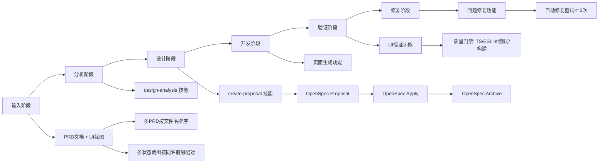

# PRD + UI 自动实现端到端流程图

## 1. 适用范围

本流程用于语义触发“基于 docs/prd 与 docs/ui 自动实现前端工程”的执行链路，目标为“上线就绪”。

## 2. 阶段与能力映射图（Flowchart）



## 3. 状态机图（State Diagram）

```mermaid
stateDiagram-v2
  [*] --> InputStage

  InputStage --> AnalyzeStage: 命中语义触发
  InputStage --> NormalFlowEnd: 未命中

  AnalyzeStage --> DesignStage
  DesignStage --> ProposalStage
  ProposalStage --> OpenSpecValidating
  OpenSpecValidating --> ProposalStage: 校验失败并修复
  OpenSpecValidating --> ApplyStage: 校验通过
  ApplyStage --> DevelopStage: 默认确认进入实施

  DevelopStage --> RiskConfirming: 命中高风险
  RiskConfirming --> DevelopStage: 用户确认继续

  DevelopStage --> VerifyStage
  VerifyStage --> FixStage: 验证未通过
  FixStage --> VerifyStage: 修复后回归验证

  VerifyStage --> CurrentPrdPassed: 验证通过
  FixStage --> CurrentPrdFailed: 重试耗尽

  CurrentPrdPassed --> NextPrdDecision
  CurrentPrdFailed --> NextPrdDecision

  NextPrdDecision --> AnalyzeStage: 存在下一份PRD
  NextPrdDecision --> SummaryStage: 无下一份PRD

  SummaryStage --> ArchiveStage
  ArchiveStage --> ReadyForRelease
  NormalFlowEnd --> [*]
  ReadyForRelease --> [*]

  state InputStage as "输入阶段"
  state AnalyzeStage as "分析阶段"
  state DesignStage as "设计阶段"
  state ProposalStage as "OpenSpec Proposal"
  state ApplyStage as "OpenSpec Apply"
  state DevelopStage as "开发阶段"
  state VerifyStage as "验证阶段"
  state FixStage as "修复阶段"
  state SummaryStage as "汇总阶段"
  state ArchiveStage as "OpenSpec Archive"
  state ReadyForRelease as "上线就绪"
  state NormalFlowEnd as "按普通流程处理"
```

## 4. 关键流程规则

1. 先 OpenSpec 后实现，禁止跳过。
2. UI 验收以截图为优先基线，分析清单为辅助。
3. 失败重试最多 2 次，单 PRD 失败不阻断后续。
4. 结果允许少量非阻断问题，但必须明确标注。
5. 本轮输出是上线就绪，不含实际部署动作。
