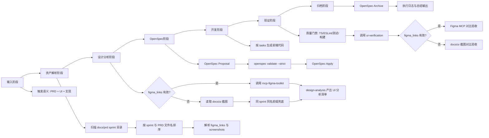

# PRD + UI 自动实现端到端流程图

## 1. 适用范围

本流程用于语义触发“基于 docs/prd 与 docs/ui 自动实现前端工程”的执行链路，目标为“上线就绪”。

## 2. 阶段与能力映射图（Flowchart）


```mermaid
flowchart LR
  A[输入阶段] --> B[资产解析阶段] --> C[设计分析阶段] --> D[OpenSpec阶段] --> E[开发阶段] --> F[验证阶段] --> G[归档阶段]

  A --> A1[触发语义: PRD + UI + 实现]
  B --> B1[扫描 docs/prd sprint 目录]
  B1 --> B2[按 sprint 与 PRD 文件名排序]
  B2 --> B3[解析 figma_links 与 screenshots]

  C --> C1{figma_links 有效?}
  C1 -->|是| C2[调用 mcp-figma-toolkit]
  C1 -->|否| C3[读取 docs/ui 截图]
  C3 --> C4[同 sprint 同名前缀兜底]
  C2 --> C5[design-analysis 产出 UI 分析清单]
  C4 --> C5

  D --> D1[OpenSpec Proposal]
  D1 --> D2[openspec validate --strict]
  D2 --> D3[OpenSpec Apply]

  E --> E1[按 tasks 生成前端代码]
  F --> F1[质量门禁: TS/ESLint/测试/构建]
  F1 --> F2[调用 ui-verification]
  F2 --> F3{figma_links 有效?}
  F3 -->|是| F4[Figma MCP 对比验收]
  F3 -->|否| F5[docs/ui 截图对比验收]

  G --> G1[OpenSpec Archive]
  G1 --> G2[执行日志与总结输出]
```

## 3. 状态流转图（文本版）

```text
开始
-> 语义识别（PRD + UI + 实现）
-> 扫描 docs/prd（按 sprint/文件名排序）
-> 解析 figma_links 与 screenshots
  -> figma_links 有效：调用 mcp-figma-toolkit
  -> 无效：按 screenshots 或同 sprint 前缀匹配 docs/ui
-> design-analysis 生成 UI 分析清单
-> Proposal（生成 proposal/tasks/spec delta）
-> strict 校验
  -> 失败：修复后回到 Proposal 校验
  -> 通过：默认确认进入 Apply（高风险时人工确认）
-> Apply（按 tasks 实施并持续回写状态）
-> 质量门禁（TS/ESLint/测试/构建）
  -> 失败：自动修复并重试（最多 2 次）
  -> 通过：调用 ui-verification
-> UI 验收（figma_links 优先走 Figma MCP；否则使用 docs/ui 截图）
-> 同步核对 design-analysis 清单 + spec 增量
-> Archive（openspec archive + openspec validate --strict）
-> 单 PRD 结束（失败不阻断后续 PRD）
-> 全部 PRD 汇总输出
-> 结束
```

## 4. 关键流程规则

1. 先 OpenSpec 后实现，禁止跳过。
2. 设计源优先级固定为 `figma_links` > `screenshots` > 同 sprint 前缀兜底。
3. 代码生成后必须调用 ui-verification 完成 UI 验收。
4. 有效 figma_links 场景必须以 Figma MCP 取证为验收基线。
5. 失败重试最多 2 次，单 PRD 失败不阻断后续。
6. 结果允许少量非阻断问题，但必须明确标注。
7. 本轮输出是上线就绪，不含实际部署动作。